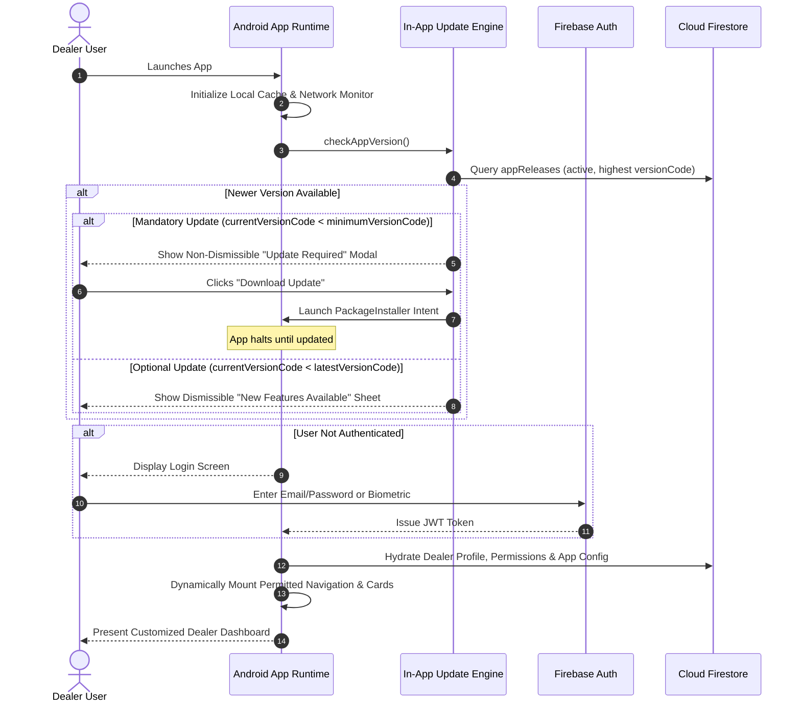

# Pixel Distributor - Unified Android Application Architecture

## 1. Single Application Principle

> [!IMPORTANT]
> There is **exactly ONE common Pixel Distributor Android application** codebase and build target.
> We do NOT generate, compile, or distribute custom APKs per dealer. A single APK downloaded by 10,000 different dealers will adapt dynamically to each dealer's unique business identity, permitted modules, pricing structures, and dashboard widgets upon authentication.

---

## 2. Technical Stack & Architecture

The Android application is implemented as an enterprise-grade hybrid application leveraging **Capacitor** with native Android bridges or **React Native**, backed by our shared TypeScript core:

```
┌────────────────────────────────────────────────────────────────────────┐
│                        UNIFIED ANDROID RUNTIME                         │
├────────────────────────────────────────────────────────────────────────┤
│   Presentation Layer: Mobile-First React + Tailwind CSS (Responsive)   │
├────────────────────────────────────────────────────────────────────────┤
│   State & Cache: Zustand + TanStack Query + IndexedDB / SQLite Offline │
├────────────────────────────────────────────────────────────────────────┤
│   Capacitor Bridge Layer:                                              │
│   • Push Notifications (Firebase Cloud Messaging)                      │
│   • Device Information (Model, OS, Current versionCode)               │
│   • Secure Storage / Keystore (Biometric Auth Tokens)                  │
│   • Network Status Listener (Offline Mode Toggle)                      │
│   • App Updater Plugin (Download & PackageInstaller Intent Bridge)     │
├────────────────────────────────────────────────────────────────────────┤
│   Native Android Host (Gradle, JVM 17, Android SDK 34 / API 24+)       │
└────────────────────────────────────────────────────────────────────────┘
```

---

## 3. Application Lifecycle & Startup Sequence



---

## 4. Mobile Screen Architecture

The mobile application implements 13 standard screens, strictly guarded by the permission engine:

1. **`LoginScreen`:** Supports email/password, "Remember Me", biometric unlock (Fingerprint/FaceID via Keystore), and offline session resume.
2. **`DashboardScreen`:** Configurable widget grid dynamically rendered according to `appConfigurations.dashboardCards`:
   - `SalesCard`: Month-to-date turnover and trend chart.
   - `OrdersCard`: Active orders count (Pending / Dispatched).
   - `InventoryCard`: Low stock alerts and available SKU count.
   - `OutstandingCard`: Current balance versus credit limit meter.
   - `CustomersCard`: Total client accounts registered.
   - `NotificationsCard`: Unread broadcast announcements.
3. **`InventoryScreen`:** Fast, searchable list of products with barcode scanner integration, search-as-you-type, and stock filters.
4. **`ProductDetailScreen`:** High-res imagery, specifications, variants, and price matrix:
   - Evaluates `appConfigurations.priceVisibility`: Masks purchase cost; shows Dealer Price and/or MRP.
5. **`OrdersScreen`:** Segmented list (`All`, `Pending`, `Processing`, `Completed`, `Cancelled`) with date-range filters.
6. **`OrderDetailScreen`:** Line-item breakdown, tax calculation, PDF invoice generation/download, and status history timeline.
7. **`OrderCreateScreen`:** Cart-based ordering workflow, item quantity selector, customer selection, credit limit warning, and submit button (gated by `canCreateOrders`).
8. **`CustomersScreen`:** Dealer-scoped customer directory with quick phone call and WhatsApp actions.
9. **`CustomerDetailScreen`:** Customer transaction history, total purchases, and outstanding dues.
10. **`PaymentsScreen`:** Ledger view showing invoices, payments received, pending settlements, and receipt submission form.
11. **`ReportsScreen`:** Mobile-optimized visual charts for sales trends, top products, and monthly growth.
12. **`NotificationsScreen`:** Broadcast alerts, order milestone notifications, and direct deep-links.
13. **`ProfileAndSettingsScreen`:** Business details, assigned warehouse contact, app version info, manual cache refresh, and logout.

---

## 5. Offline & Network Resilience Strategy

Dealers frequently operate in warehouses or semi-urban markets with intermittent cellular coverage:

1. **Local Persistent Cache:** Product catalogs and recent orders are cached locally using IndexedDB (Web) and SQLite / native cache (Android).
2. **Read Availability:** If network connectivity drops (`networkStatus.connected === false`), the app switches to an Amber "Offline Mode" banner. The dealer can view cached catalog items, previous orders, and customer lists.
3. **Optimistic Order Queuing:** New orders created offline are saved in a local Outbox queue (`offlineOrderQueue`). When connectivity is restored, the queue flushes automatically with idempotency keys (`clientMutationId`) to prevent duplicate submissions.

---

## 6. Native Android Update Installation Flow

Android security restricts silent installation of applications from outside the Google Play Store. The application follows official Android OS guidelines for self-hosted distribution:

1. **Download:** The app downloads the updated APK binary from Google Cloud Storage to the app's secure cache directory (`Context.getExternalFilesDir(Environment.DIRECTORY_DOWNLOADS)`).
2. **Checksum Verification:** The SHA-256 hash of the downloaded file is verified against `appReleases.checksum` to protect against corrupted downloads or MITM manipulation.
3. **Installation Intent:** The app triggers an `ACTION_VIEW` or `PackageInstaller` intent via a secure `FileProvider`:

```kotlin
val apkUri = FileProvider.getUriForFile(
    context, 
    "${context.packageName}.fileprovider", 
    downloadedApkFile
)
val intent = Intent(Intent.ACTION_VIEW).apply {
    setDataAndType(apkUri, "application/vnd.android.package-archive")
    addFlags(Intent.FLAG_GRANT_READ_URI_PERMISSION)
    addFlags(Intent.FLAG_ACTIVITY_NEW_TASK)
}
context.startActivity(intent)
```

4. **User Guidance:** The app displays an intuitive modal guiding the user to tap "Install" on the system package installer prompt.
