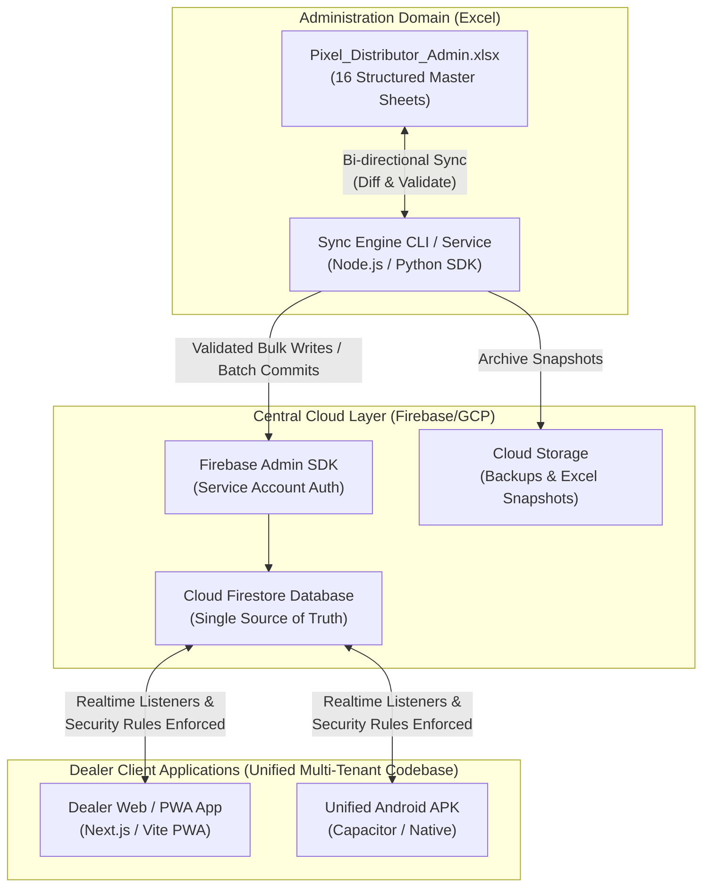
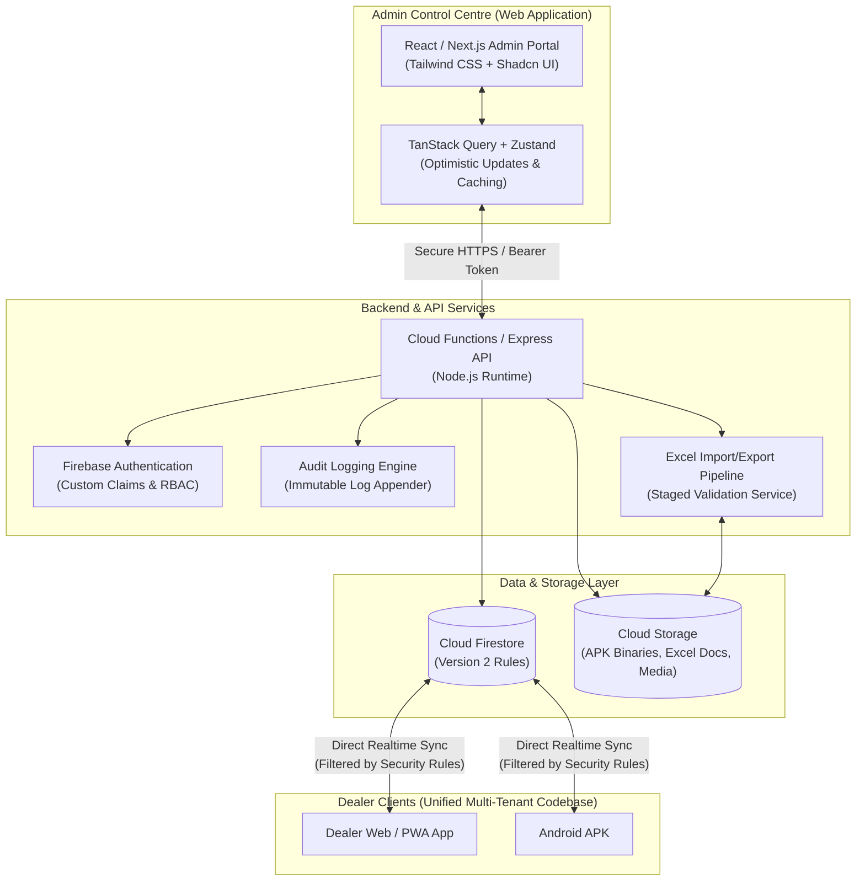
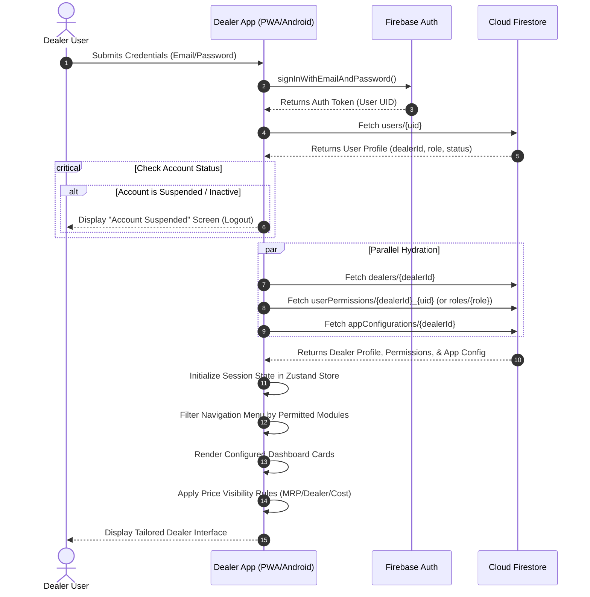

# Pixel Distributor - System Architecture Specification

## 1. Architectural Philosophy & Core Tenet

The cornerstone of the Pixel Distributor platform is **strict multi-tenancy within a single unified codebase**.

### Key Architectural Tenet: The Single-Engine Rule
> [!IMPORTANT]
> Under **no circumstances** will separate client applications or backend services be instantiated for individual dealers.
> Both the Web/PWA and Android APK applications are compiled from a single codebase that acts as a chameleon: upon authentication, the application discovers the user's `dealerId`, `role`, `permissionProfile`, and `appConfiguration`, hydrating the UI and restricting data pipelines accordingly.

```
                                  ┌──────────────────────────┐
                                  │   AUTHENTICATED USER     │
                                  └─────────────┬────────────┘
                                                │ (Bearer Token / Firebase Auth)
                                                ▼
                                  ┌──────────────────────────┐
                                  │   TENANT DISCOVERY       │
                                  │  • Dealer ID             │
                                  │  • User Role             │
                                  │  • Permission Profile    │
                                  │  • App Configuration     │
                                  └─────────────┬────────────┘
                                                │
                     ┌──────────────────────────┴──────────────────────────┐
                     ▼                                                     ▼
      ┌─────────────────────────────┐                       ┌─────────────────────────────┐
      │     DATA ISOLATION LAYER    │                       │    UI PRESENTATION LAYER    │
      │ • Firestore Rules Scope     │                       │ • Permitted Routes Only     │
      │ • Backend Scope Filtering   │                       │ • Configured Dashboard Cards│
      │ • Immutable Tenant Stamping │                       │ • Field-level Masking       │
      │   (dealerId enforced)       │                       │   (Cost/MRP/Actions)        │
      └─────────────────────────────┘                       └─────────────────────────────┘
```

---

## 2. Plan A: Excel-Centric Hybrid Architecture

Plan A is designed for operations where administrative leadership prefers Excel as their primary workspace for inventory management, price adjustments, dealer assignments, and reporting.

### 2.1 Component Architecture


### 2.2 Operational Workflow in Plan A
1. **Master Data Authoring:** The administrator updates stock levels, adds dealers, creates product SKUs, or adjusts price groups directly inside `Pixel_Distributor_Admin.xlsx`.
2. **Schema & Constraint Validation:** The workbook utilizes structured Excel Tables, named ranges, formulaic sanity checks, and data validation dropdowns to minimize human error.
3. **Synchronization Execution:** The admin executes the synchronization tool (`npm run sync:push` or a bound desktop utility).
4. **Staging & Diffing:** The sync engine reads the workbook, converts it to canonical JSON schemas, validates every row against Zod validation models, and diffs against the existing Firestore snapshot.
5. **Atomic Cloud Commit:** The engine writes delta changes using Firestore atomic batched writes, creating immutable transaction records for any stock change.
6. **Inbound Sync (Pull):** Orders, payments, and dealer activity captured in the mobile/PWA apps are pulled back down into the Excel workbook via `npm run sync:pull`, keeping the admin sheet synchronized with field operations.

---

## 3. Plan B: Full Platform Architecture

Plan B delivers a modern, cloud-native, web-based Admin Control Centre alongside the Dealer Web/PWA and Android apps, eliminating manual file sync while preserving Excel for bulk imports and analytical reports.

### 3.1 Component Architecture


### 3.2 Operational Workflow in Plan B
1. **Interactive Administration:** Central administrators manage dealers, assign permissions, approve stock transfers, and configure dealer apps through a responsive web interface.
2. **Real-time Event Propagation:** When an administrator alters a dealer's permissions or app configuration, the update is committed to Firestore and instantly pushed to the active dealer device via snapshot listeners.
3. **Audited Actions:** Every creation, update, suspension, or inventory adjustment is validated through server-side logic and logged to `activityLogs`.
4. **Bulk Excel Handling:** Rather than being the core database, Excel is supported through a secure 5-stage ETL workflow: **Upload -> Validate -> Preview -> Confirm -> Import**.

---

## 4. Architectural Comparison & Separation Strategy

| Architectural Dimension | Plan A (Excel-Centric Hybrid) | Plan B (Full Platform) |
| :--- | :--- | :--- |
| **Primary Admin Interface** | Microsoft Excel / Office 365 (`.xlsx`) | Modern Web Control Centre (React/Next.js) |
| **System of Record** | Hybrid (Excel local + Cloud Firestore) | Cloud Firestore (Single Source of Truth) |
| **Sync Latency** | Scheduled / On-Demand Sync Batches | Real-time (sub-second Firestore listeners) |
| **Dealer App Access** | Multi-tenant Web/PWA & Android APK | Multi-tenant Web/PWA & Android APK |
| **Audit Logging** | Local sync log + Cloud transaction mirror | Real-time automated server-side audit logs |
| **Excel Role** | Operational Master Control Center | Bulk Import, Export & Business Intelligence |
| **Offline Capability** | High (Excel runs 100% offline locally) | PWA/Android offline cache with online sync |
| **Setup Complexity** | Lower initial web infrastructure | Full web infrastructure deployment |

### Separation Strategy
Both Plan A and Plan B share:
- Identical Firestore collections and data models.
- The exact same multi-tenant Dealer Web/PWA and Android APK client codebases.
- Identical `shared/types`, `shared/permissions`, and `shared/validation` packages.
- Identical Firestore security rules enforcing tenant boundaries.

This ensures that adopting Plan A initially does not create legacy technical debt if migrating to or co-existing with Plan B.

---

## 5. Technology Stack Selection & Justification

### 5.1 Shared Core (`shared/`)
- **TypeScript:** Strict type checking across models, payloads, and permission evaluations.
- **Zod:** Runtime schema validation for API inputs, Excel imports, and document writes.

### 5.2 Frontend Applications (`apps/admin` & `apps/dealer-web`)
- **Framework:** Next.js (App Router) or Vite + React (TypeScript). Fast loading, strong PWA support, small bundle sizes.
- **Styling:** Tailwind CSS with Lucide icons. Enables clean mobile-first UI with responsive breakpoints.
- **State & Server Cache:** TanStack Query (React Query) for API synchronization, Zustand for local client context (dealer scope, offline flags).
- **PWA Capabilities:** `next-pwa` or `vite-plugin-pwa` providing service workers, background sync, manifest for installability, and asset caching.

### 5.3 Android Application (`apps/android`)
- **Strategy:** Capacitor-wrapped Web/PWA engine with native Android plugins for:
  - Background notifications.
  - Native APK package installer intent handling (`ACTION_VIEW`).
  - Secure local keystore / biometric authentication.
  - Device info & network liveness monitoring.
- **Benefits:** Guarantees 100% UI consistency between Web/PWA and Android without maintaining duplicated UI logic across Kotlin and React.

### 5.4 Backend & Cloud Infrastructure (`backend/` & `firebase/`)
- **Database:** Google Cloud Firestore (Document NoSQL) with rules version 2.
- **Authentication:** Firebase Authentication (Email/Password, Phone OTP) with Custom User Claims for role and tenant isolation.
- **API Runtime:** Firebase Cloud Functions (Node.js 22 LTS).
- **Storage:** Google Cloud Storage for APK binary distribution, document attachments, and Excel archives.
- **Security & Integrity:** Firebase App Check with Play Integrity (Android) and reCAPTCHA Enterprise (Web).

---

## 6. Multi-Tenant Runtime Hydration Flow

When a user opens the Dealer Web/PWA or Android App, the following bootstrap sequence executes:



---

## 7. Transaction-Based Inventory Engine

The platform strictly prohibits manual overwriting of stock quantities (`stock = new_value`).

### The Invariant Stock Equation
For any product SKU at any warehouse or dealer node:

$$\text{Current Stock} = \text{Opening Stock} + \text{Stock In} + \text{Transfers In} - \text{Transfers Out} - \text{Sales} + \text{Returns} - \text{Damaged}$$

### Architectural Rules for Inventory
1. **Immutable Ledger:** Every inventory movement creates an append-only document in `inventoryTransactions`.
2. **Atomic Batch Mutations:** When stock moves, an atomic Firestore batch or Cloud Function transaction:
   - Creates the `inventoryTransactions` record.
   - Updates the denormalized summary counter on the `inventory` document.
3. **Audit Trail:** Each transaction retains:
   - `transactionId`, `sku`, `productId`, `sourceLocation`, `targetLocation`, `quantity`, `type`, `referenceId` (Order ID, Transfer ID, Inward ID), `actorId`, `timestamp`.
4. **Negative Stock Prevention:** Transaction operations fail atomically if the resulting stock balance falls below zero.
