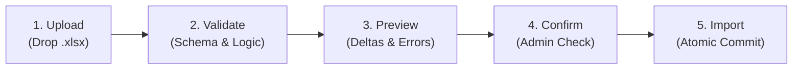

# Pixel Distributor - Excel Administration System & Staged ETL Pipeline

## 1. Overview & Dual Purpose of the Excel System

The Excel system serves two distinct operational functions depending on the active deployment model:

1. **In Plan A (Excel-Centric Hybrid):** `Pixel_Distributor_Admin.xlsx` serves as the **Primary Administrative Desktop Interface**. Administrators manage dealers, products, permissions, and inventory in this workbook, synchronizing bi-directionally with Cloud Firestore via the Sync Engine CLI.
2. **In Plan B (Full Platform):** Excel serves as the **Bulk Data Operations Bridge** for batch importing catalogs, price lists, inventory adjustments, and exporting financial/analytical reports through a strict 5-stage validation gate.

---

## 2. Workbook Architecture (16 Master Worksheets)

The central workbook `Pixel_Distributor_Admin.xlsx` contains 16 interconnected, professionally formatted worksheets. 
Every data sheet uses **Excel Structured Tables** (ListObjects) and **Named Ranges**—fragile, hard-coded cell coordinates (`$B$4:$B$99`) are strictly prohibited.

```
┌────────────────────────────────────────────────────────────────────────┐
│               PIXEL DISTRIBUTOR ADMIN WORKBOOK STRUCTURE               │
├───────────────────┬───────────────────┬────────────────────────────────┤
│ Executive & BI    │ Master Catalogs   │ Transactional & Operational    │
├───────────────────┼───────────────────┼────────────────────────────────┤
│ 1. DASHBOARD      │ 2. DEALER_MASTER  │ 6. INVENTORY                   │
│ 13. REPORTS       │ 3. USER_ACCOUNTS  │ 7. STOCK_IN                    │
│ 15. ACTIVITY_LOG  │ 4. PERMISSIONS    │ 8. STOCK_OUT                   │
│ 16. SETTINGS      │ 5. PRODUCT_MASTER │ 9. STOCK_TRANSFER              │
│                   │ 14. APP_CONFIG    │ 10. ORDERS                     │
│                   │                   │ 11. CUSTOMERS                  │
│                   │                   │ 12. PAYMENTS                   │
└───────────────────┴───────────────────┴────────────────────────────────┘
```

### Detailed Worksheet Specifications

#### Sheet 1: `DASHBOARD`
- **Purpose:** Executive overview of total dealer count, active dealers, central warehouse stock valuation, outstanding receivables, daily order volume, and sync health status.
- **Components:** KPI cards driven by `=SUMIFS`, `=COUNTIFS`, dynamic sparklines, and synchronized pivot charts for Monthly Sales Trends.
- **Sync Control:** Action buttons linked to macro/CLI triggers: `[ Sync to Cloud ]`, `[ Fetch Latest Cloud Data ]`, `[ Validate Formulas ]`.

#### Sheet 2: `DEALER_MASTER`
- **Table Name:** `tbl_Dealers`
- **Columns:** `Dealer_ID`, `Business_Name`, `Owner_Name`, `Mobile`, `WhatsApp`, `Email`, `GSTIN`, `PAN`, `Address`, `City`, `State`, `PIN`, `Dealer_Type`, `Price_Group`, `Credit_Limit`, `Payment_Terms`, `Assigned_Warehouse`, `Account_Status`, `Outstanding_Bal`, `App_ID`.
- **Validation:** 
  - `Dealer_Type` dropdown (`PLATINUM`, `GOLD`, `SILVER`, `STANDARD`).
  - `Account_Status` dropdown (`ACTIVE`, `SUSPENDED`, `PENDING`).
  - `GSTIN` format validation regex mask.
  - Unique constraint alert on duplicate `Dealer_ID` or `Mobile`.

#### Sheet 3: `USER_ACCOUNTS`
- **Table Name:** `tbl_UserAccounts`
- **Columns:** `User_ID`, `Dealer_ID`, `Email`, `Display_Name`, `Phone`, `Role`, `Status`, `Last_Login`.
- **Validation:**
  - `Dealer_ID` validated against `tbl_Dealers[Dealer_ID]` using `=XLOOKUP`.
  - `Role` dropdown (`SUPER_ADMIN`, `ADMIN`, `INVENTORY_MANAGER`, `SALES_MANAGER`, `DEALER`, `DEALER_STAFF`, `VIEWER`).

#### Sheet 4: `PERMISSIONS`
- **Table Name:** `tbl_Permissions`
- **Columns:** `Dealer_ID`, `User_ID`, `Dashboard`, `Inventory`, `Orders`, `Customers`, `Payments`, `Reports`, `App_Management`, `Settings`.
- **Validation:**
  - Capability dropdowns for every module: `["HIDDEN", "VIEW", "CREATE", "EDIT", "DELETE", "ADMIN"]`.
  - Conditional formatting color scales: `HIDDEN` (gray), `VIEW` (blue), `CREATE`/`EDIT` (green), `ADMIN` (purple).

#### Sheet 5: `PRODUCT_MASTER`
- **Table Name:** `tbl_Products`
- **Columns:** `Product_ID`, `SKU`, `Name`, `Category`, `Brand`, `Model`, `Variant`, `Unit`, `MRP`, `Purchase_Price`, `Dealer_Price_Tier1`, `Dealer_Price_Tier2`, `Reorder_Level`, `Status`.
- **Validation:**
  - SKU uniqueness check (`=IF(COUNTIF([SKU],[@SKU])>1,"DUPLICATE","OK")`).
  - Minimum margin conditional highlight (`=[@Dealer_Price_Tier1] < [@Purchase_Price]`).

#### Sheet 6: `INVENTORY`
- **Table Name:** `tbl_CurrentInventory`
- **Columns:** `Location_Type`, `Location_ID`, `Location_Name`, `Product_ID`, `SKU`, `Product_Name`, `Quantity`, `Reserved_Qty`, `Available_Qty`, `Reorder_Level`, `Stock_Status`.
- **Formulas:**
  - `[Available_Qty]` = `[@Quantity] - [@Reserved_Qty]`.
  - `[Stock_Status]` = `=IF([@Available_Qty]<=0,"OUT OF STOCK", IF([@Available_Qty]<=[@Reorder_Level],"LOW STOCK","NORMAL"))`.

#### Sheet 7: `STOCK_IN`
- **Table Name:** `tbl_StockIn`
- **Columns:** `Entry_ID`, `Date`, `Warehouse_ID`, `SKU`, `Product_Name`, `Quantity`, `Unit_Cost`, `Total_Cost`, `Vendor`, `Invoice_Ref`, `Entered_By`.
- **Behavior:** Immutable transaction log feed for incoming supplier stock.

#### Sheet 8: `STOCK_OUT`
- **Table Name:** `tbl_StockOut`
- **Columns:** `Exit_ID`, `Date`, `Warehouse_ID`, `SKU`, `Product_Name`, `Quantity`, `Reason`, `Reference_ID`, `Approved_By`.
- **Validation:** `Reason` dropdown (`DAMAGED`, `EXPIRED`, `INTERNAL_USE`, `AUDIT_DISCREPANCY`).

#### Sheet 9: `STOCK_TRANSFER`
- **Table Name:** `tbl_StockTransfers`
- **Columns:** `Transfer_ID`, `Date`, `Source_Warehouse`, `Destination_Dealer`, `SKU`, `Quantity`, `Status`, `Tracking_Ref`, `Dispatched_Date`, `Received_Date`.
- **Validation:** `Status` dropdown (`REQUESTED`, `APPROVED`, `DISPATCHED`, `DELIVERED`, `CANCELLED`).

#### Sheet 10: `ORDERS`
- **Table Name:** `tbl_Orders`
- **Columns:** `Order_ID`, `Date`, `Dealer_ID`, `Customer_Name`, `Item_Count`, `Subtotal`, `Tax`, `Total_Amount`, `Order_Status`, `Payment_Status`.
- **Validation:** `Order_Status` dropdown (`DRAFT`, `PENDING`, `CONFIRMED`, `PROCESSING`, `DISPATCHED`, `COMPLETED`, `CANCELLED`).

#### Sheet 11: `CUSTOMERS`
- **Table Name:** `tbl_Customers`
- **Columns:** `Customer_ID`, `Dealer_ID`, `Customer_Name`, `Phone`, `Email`, `City`, `State`, `Total_Orders`, `Total_Spent`.

#### Sheet 12: `PAYMENTS`
- **Table Name:** `tbl_Payments`
- **Columns:** `Payment_ID`, `Date`, `Dealer_ID`, `Order_ID`, `Amount`, `Mode`, `Reference_Number`, `Status`, `Verified_By`.
- **Validation:** `Mode` dropdown (`NEFT`, `RTGS`, `UPI`, `CHEQUE`, `CASH`, `CREDIT_NOTE`).

#### Sheet 13: `REPORTS`
- **Purpose:** Pre-built pivot tables and summary dashboards:
  - Top 10 Performing Dealers by Monthly Turnover.
  - Dead Stock & Slow Moving SKU Analyzer (>60 days zero sales).
  - Outstanding Receivables Aging (>30 days, >60 days, >90 days).

#### Sheet 14: `APP_CONFIG`
- **Table Name:** `tbl_AppConfigurations`
- **Columns:** `Dealer_ID`, `Price_Visibility`, `MRP_Visible`, `Cost_Visible`, `Order_Creation_Enabled`, `Product_Edit_Enabled`, `Stock_Request_Enabled`, `Visible_Modules`, `Dashboard_Cards`.
- **Validation:**
  - `Cost_Visible` is locked to `FALSE` for non-admin accounts.
  - Dropdown options for display policies.

#### Sheet 15: `ACTIVITY_LOG`
- **Table Name:** `tbl_AuditJournal`
- **Columns:** `Timestamp`, `Actor`, `Role`, `Action`, `Entity`, `Entity_ID`, `Summary`.
- **Behavior:** Read-only mirror of cloud audit entries, updated during sync pull.

#### Sheet 16: `SETTINGS`
- **Table Name:** `tbl_SystemConfig`
- **Columns:** `Setting_Key`, `Setting_Value`, `Description`, `Last_Updated`.
- **Parameters:** Tax rates, currency symbols, standard credit terms, cloud API endpoint URL, sync polling frequency.

---

## 3. Plan A Bi-Directional Synchronization Engine

The sync engine is a high-reliability Node.js CLI tool (`scripts/excel-sync.ts`) using `xlsx` (SheetJS) and the Firebase Admin SDK.

```
┌────────────────────────────────────────────────────────────────────────┐
│                     BI-DIRECTIONAL SYNC ENGINE (PLAN A)                │
├────────────────────────────────────────────────────────────────────────┤
│                                                                        │
│   PUSH (Excel -> Firestore):                                           │
│   1. Read Excel tables -> Parse into typed DTOs                        │
│   2. Validate against Zod schemas                                      │
│   3. Compute Diff against Firestore cache                              │
│   4. Generate immutable inventoryTransactions for stock deltas         │
│   5. Execute batched write (up to 500 ops / batch)                     │
│   6. Stamp sync timestamp in `tbl_SystemConfig`                        │
│                                                                        │
│   PULL (Firestore -> Excel):                                           │
│   1. Query Firestore for records where `updatedAt > lastSyncTimestamp` │
│   2. Fetch newly placed orders, payments, customer creations           │
│   3. Append / Update corresponding rows in Excel Structured Tables     │
│   4. Refresh workbook calculations and pivot caches                    │
└────────────────────────────────────────────────────────────────────────┘
```

---

## 4. Plan B Staged Bulk Import / Export Pipeline

Under Plan B, direct Excel synchronization is replaced by an enterprise-grade 5-stage import gate in the Admin Web Control Centre:



### Supported Batch Workbooks
1. **`Products.xlsx`**: Mass SKU creation, description updates, category re-assignments.
2. **`Dealers.xlsx`**: Batch onboarding of dealer partners with credit lines.
3. **`Inventory.xlsx`**: Warehouse stock reconciliation and opening balance imports.
4. **`PriceList.xlsx`**: Bulk adjustment of Tier 1 / Tier 2 dealer pricing matrices.

### Rules of the Import Engine
- **Atomic Rollback:** If validation fails on any single record during Stage 2, the entire batch is halted.
- **Detailed Error Manifest:** A downloadable report highlighting the exact row, column, and error message (e.g. `Row 42: Duplicate SKU 'PX-PHN-01' already exists`).
- **Never Overwrite Blindly:** Stage 3 presents a color-coded preview:
  - Green: New records to be created.
  - Yellow: Existing records that will be updated (with side-by-side diff).
  - Red: Validation conflicts requiring resolution.
